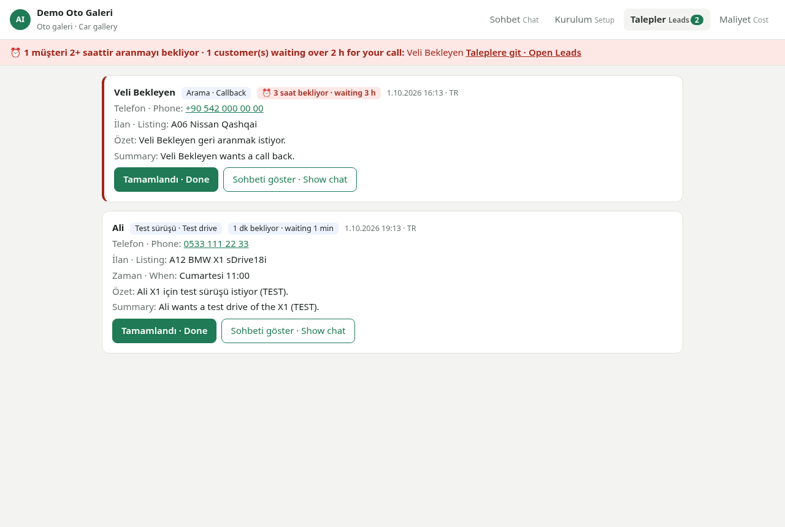

# AI Customer Assistant

An AI that answers a small business's customers by itself, at any hour, in **Turkish, English, Russian and Persian**.
It uses only that business's own stock, prices and policies, saves serious customers as **leads**, and keeps
reminding the owner until somebody calls them back.

Two editions, built for businesses in North Cyprus:

| Folder | For | Demo data |
|---|---|---|
| [`car-gallery/`](car-gallery) | Used-car galleries | 12 cars from [er369ai.github.io/galeri](https://er369ai.github.io/galeri/) |
| [`real-estate/`](real-estate) | Estate agencies | 8 invented listings (sale and rent) |

> **Status: working prototype (October 2026).** Tested end to end with automated tests and a stand-in model (see
> [Testing](#testing)). Not yet run against the live Claude API and not yet connected to WhatsApp.



## What it does
- **Answers from the business's own info only.** If something isn't on the Setup page, it says it will ask the owner
  instead of guessing. No invented prices, cars or policies.
- **Sells within the rules.** No discounts, never offers sold or reserved items, never confirms an appointment
  (only the owner can), and says honestly that it is a virtual assistant when asked.
- **Captures leads with tool use.** When a customer wants a test drive, viewing, offer or call, it collects name,
  phone and a time, one question at a time, then calls a `save_lead` tool. The owner gets a Turkish and English summary
  plus the full chat.
- **Reminds the owner.** A lead not marked done after N hours (default 2) raises a red banner on every tab, a count
  in the browser tab title and a desktop alert. It re-checks every minute.
- **Shows its cost.** Every reply's cost is logged, so a monthly price can be set from real numbers.
- **Setup page for the owner.** Business info, opening hours, policies and an editable stock table. Changes apply
  to the next message.

## How it works
```
customer message ──► app.py (local server) ──► assistant.py
                                                 │  system prompt = prompt.md + business.json (cached)
                                                 │  + conversation so far + local time note
                                                 ▼
                                           Claude API (Messages, tool use)
                                                 │  text reply ──────────────► chat
                                                 │  save_lead(name, phone, …) ► data/leads.jsonl ► Leads tab + reminders
```
- **Model:** `claude-opus-5-5` by default (`claude-sonnet-5-5` selectable), low effort for chat, server-side
  refusal fallback, prompt caching on the business info.
- **Append-only history**, with thinking blocks passed back unchanged. A failed or declined turn is rolled back
  cleanly.
- **Local and private.** It binds to `127.0.0.1` and rejects other Host and Origin headers, so another website can't
  use the key. The API key is stored with `chmod 600` and never sent to the browser.
- **No framework.** Python standard library HTTP server, one HTML file, the official `anthropic` SDK.

Full walkthrough: **[HOW_IT_WORKS.md](HOW_IT_WORKS.md)**.

## Try it yourself
You need **Python 3.10 or newer** ([python.org](https://www.python.org/downloads/)) and a **Claude API key**
([console.anthropic.com](https://console.anthropic.com) → API Keys; a few dollars of credit is plenty to try it).

1. Download this project: green **Code** button above → **Download ZIP** → unzip it.
2. Open a terminal in the `car-gallery` folder (or `real-estate`) and run:

   **Mac / Linux**
   ```sh
   ./start.sh
   ```
   **Windows** (PowerShell or Command Prompt)
   ```bat
   python -m venv .venv
   .venv\Scripts\pip install -r requirements.txt
   .venv\Scripts\python app.py
   ```
   Then open http://localhost:8770 (estate edition: http://localhost:8771).
3. The page opens on **Setup**. Paste your API key, type any name and WhatsApp number as the "owner", then press **Save all**.
4. Go to **Chat** and write as a customer would, in Turkish, English, Russian or Persian. Ask for a test drive and leave a
   name and number, then open **Leads**.

The first start takes about a minute while it installs the Claude library. Stop it with **Ctrl+C**.

## Testing
| Test | What it covers | Result |
|---|---|---|
| `selftest.py` (each folder) | 62 checks with a fake model: setup validation, prompt, replies, tool loop, leads, reminders, errors, Host/Origin blocking, plus the real SDK against a simulated API server | 62/62 |
| [`testing/browser_test.js`](testing/browser_test.js) | Real Chromium clicks through everything as a first-time user, with a [stand-in model](testing/standin_ai.py) | 32/32 per edition |
| [`testing/AI_answers_test_1Oct.md`](testing/AI_answers_test_1Oct.md) | 12 customer scenarios (4 languages, a reserved car, a low offer, prompt injection, missing info) answered with the app's exact instructions | 11/12; the gap (photos) was fixed in the prompt |

Screenshots of every step: [`testing/screenshots/`](testing/screenshots).

## Not built yet
- **WhatsApp connection**, through Meta's WhatsApp Business Cloud API on the business's own account. That
  comes after a business signs up. The chat tab is a demo of what a WhatsApp customer would get.
- **Phone reminders.** Reminders work while the app is open on the computer.

## About
Built by **[Erfan Boostan](https://er369ai.github.io)** in October 2026, by directing Claude Code (AI-assisted
development), with the design, rules, testing and business logic set by me.

© 2026 Erfan Boostan. All rights reserved. The code is public to show my work; please ask before reusing it.
